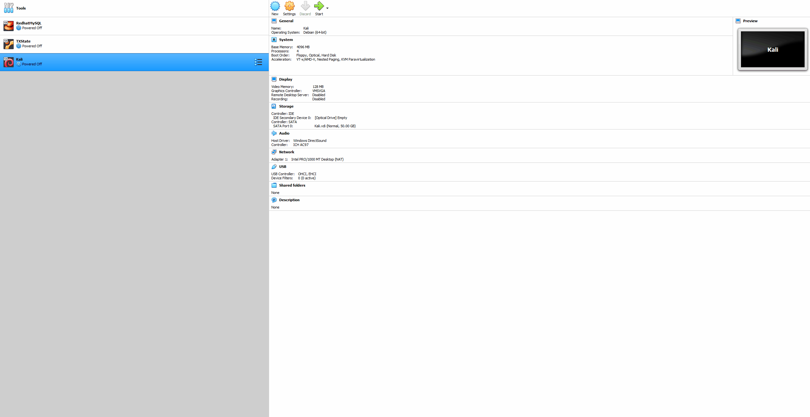

See branches for assignments.

# Project 3 - VirtualBox and Kali

Time spent: **1.5** hours spent in total

**Homework Instructions**: 

```bash
name="FirstName LastName"
univ="University of Science"

screenfetch
echo $name'@'$univ
```

Save the file as **screenfetch.gif**.

**Challenges and Problems**: 

### Installing VirtualBox and Kali


 
### Running screenfetch


