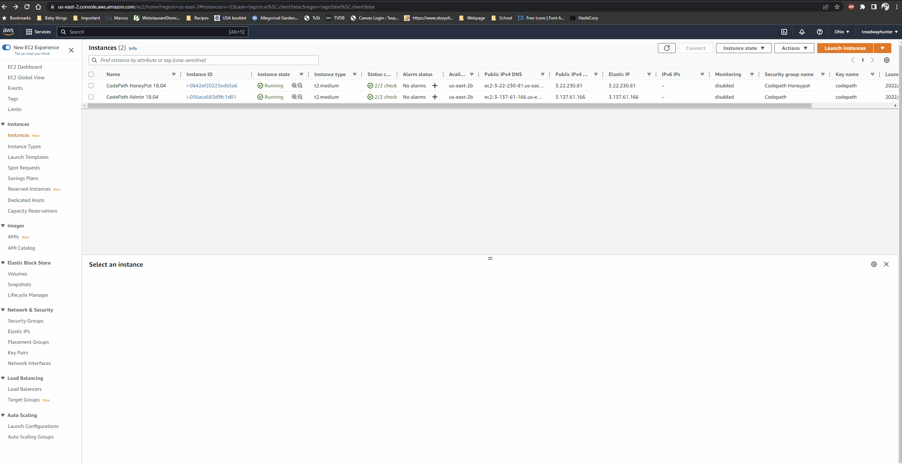
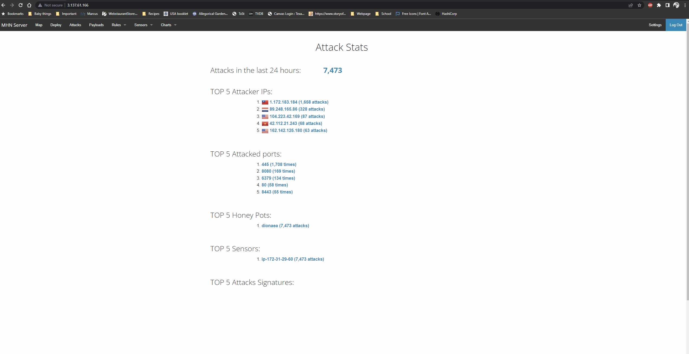

# Project 9 - Honeypot

Time spent: **4** hours spent in total

<h2>**Homework Instructions**:</h2> 
In this assignment, you will stand up a basic honeypot and demonstrate its effectiveness at detecting and/or collecting data about an attack. Guided instructions for doing this using specific software are provided below, but you are free to take any approach you wish that demonstrates the following basic principles:

- Successful configuration and deployment of a network-accessible honeypot server with two primary features:
  - An attack surface that is vulnerable or exposed in some way to network-based attacks
  - A network security feature such as an IDS configured to detect and log such attacks
- Illustration of at least one attack against the honeypot that can be detected or logged in a way that captures information about the attack or the attacker

<h2>MHN Deployment</h2>
For this part of the assignment, I went ahead and used AWS. I am familiar with AWS, and that helped me cut down some work time. However, by taking a different route, I did run into some initial problems. The current MHN code from github is not compatible with newer versions of Ubuntu, and the oldest version of Ubuntu I could use was 18.04 Server, one of the last versions MHN is supported on.

As seen in the gif, I booted up two VMs: one to act as an admin, and another as the honeypot. Using an AWS security group, I opened all TCP and UDP ports to the honeypot, leaving it wide open to attacks.

<h2>Dioanaea Honeypot Deployment</h2>
For the honeypot, I left it on for a single day to find that it had been subject to thousands of attack attempts. As attackers attempt to exploit the open ports on the honeypot, it sends data of the attacker's IP addresses to the MHN admin machine. The admin machine will also attempt to map the supposed national origin of the IP address.

<h2>Database Backup</h2>
The MHN admin machine uses MongoDB as its database. A file of session.json has been left in the repository. In the JSON, it lists the protocol used, the source IP address, a target port, and a timestamp of when the attack occurred. 

https://github.com/treadwayhunter/codepath_homework/blob/week_9/session.json

## Notes
The main challenge was initially setting up MHN. I had used Ubuntu Server 22.04, which does not support Python 2, and made MHN installation extremely difficult. It was easier to delete the VMs, and create new ones using Ubuntu Server 18.04.
