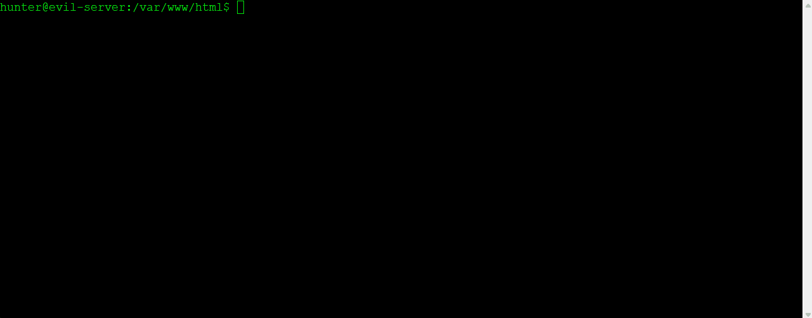

See branches for assignments.

# Project 7 - WordPress vs Kali

Time spent: **11** hours spent in total

**Homework Instructions**: 
For this week's assignment, discover and demonstrate similar proofs-of-concept for at least an additional three and (up to five) exploits affecting an older version of WP.

You can use any version of WP you like, though keep in mind that the WPDistillery setup will be less reliable for very old versions, and you may have to dive into the WP setup for versions much older than 4.x
Bonus points for Core WP exploits, but if you're having trouble identifying enough of them, you can try installing some plugins / themes to open up the attack surface -- just be sure to note this in your writeup
Try to find exploits that cover some of the different techniques we've worked with so far:
- XSS
- SQLI
- CSRF
- User Enumeration
- Privilege Escalation

You should be able to recreate most exploits via the browser running on your local machine. You can use Kali to run wpscan (or other auditing tools you can find) to do recon, but most exploits should be demonstrable via the browser
For each exploit, provide the following information in the README.md:
- A small writeup indicating the steps you used to recreate
- The types / classes of vulnerabilities involved and any related CVE identifiers
- Identify affected versions and patches
- Links to the source code, where possible
- A screen cap

User Enumeration
After doing some research, it turns out that every version of WordPress by default is susceptible to user enumeration. This can be fixed, but requires manually changing some of the source code. The wpscan tool on Kali has a built in feature specifically for user enumeration and can be used to determine if a particular WordPress setup is susceptible or not.

1)	Open Kali Linux Terminal
2)	Run the command 
•	wpscan –url <URL or IP address of server> --enumerate u
3)	When the wpscan process is done, it will list all the users it found. In my case, the admin user, and two test users I created for the purpose of this exercise.

Once this is complete, it is likely that it would be followed up with another command.
•	wpscan –url <URL or IP address of server> -passwords <path to passwords.txt>
Now that they can get ahold of users with ease, they can run a list of passwords against each user to see if they can log in as a privileged user.

  
Stored XSS via Comment Editing

1)	Log into WordPress as an administrator, open a page, and write a new comment.
2)	The comment authorizes a few html tags and attributes, allowing the potential for XSS scripting to occur if it’s not sanitized properly.
3)	As admin, I entered the comment 
•	<a href=”yahoo.com” onmouseover=alert(“xss”)>Bad Link</a>
4)	When anyone hovers over the link, the script will be executed. 

